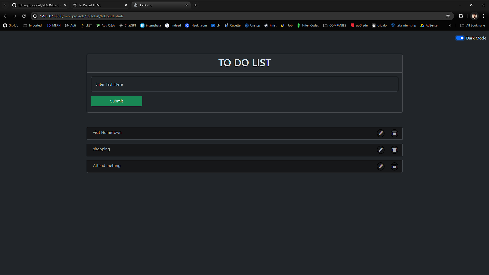

# To-Do List Application

A simple and intuitive To-Do List application built with HTML, CSS, JavaScript, and Bootstrap. The app allows users to add, update, and delete tasks. It also includes a light/dark mode toggle switch for user convenience.

## Features

- **Add Tasks**: Easily add tasks to your to-do list using the input form.
- **Delete Tasks**: Remove tasks from the list using the delete button.
- **Update Tasks**: Update any task by clicking the edit button.
- **Light/Dark Mode Toggle**: Switch between light and dark themes for a better visual experience, with your preference saved locally.

## Demo



## Technologies Used

- HTML5
- CSS3
- Bootstrap 5
- JavaScript (ES6)
- LocalStorage (to persist tasks and theme settings)

## Getting Started

Follow these instructions to get a copy of the project up and running on your local machine.

### Prerequisites

You need a modern web browser like Chrome, Firefox, or Edge to run this project.

### Installation

1. Clone the repository:

    ```bash
    git clone https://github.com/your-username/todo-list.git
    ```

2. Navigate to the project directory:

    ```bash
    cd todo-list
    ```

3. Open the `index.html` file in your browser:

    ```bash
    open index.html
    ```

### Project Structure

- `index.html`: The main HTML file containing the structure of the To-Do List.
- `task.js`: JavaScript file handling the functionality for adding, updating, deleting tasks, and theme switching.
- `style.css`: (Optional) You can include additional custom styles here.
- `README.md`: The file you're currently reading.

### How to Use

1. **Add a task**: Type your task into the input field and click the "Submit" button.
2. **Delete a task**: Click the trash icon next to a task to remove it from the list.
3. **Update a task**: Click the pencil icon to edit a task, and then resubmit it.
4. **Toggle theme**: Use the toggle switch in the top right corner to switch between light and dark themes. Your preference will be saved even when you refresh the page.

### Light/Dark Mode

This application comes with a light/dark mode toggle feature, allowing you to switch between themes. The mode is saved in your browser's `localStorage`, so your preference is retained even after closing the browser or reloading the page.

### License

This project is licensed under the MIT License - see the [LICENSE](LICENSE) file for details.

### Contributing

If you would like to contribute to this project, feel free to fork the repository and submit a pull request.

---

### Author

**Your Name**  
[GitHub Profile]([https://github.com/your-username](https://github.com/ARMANANS1218))

